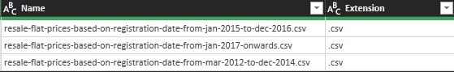
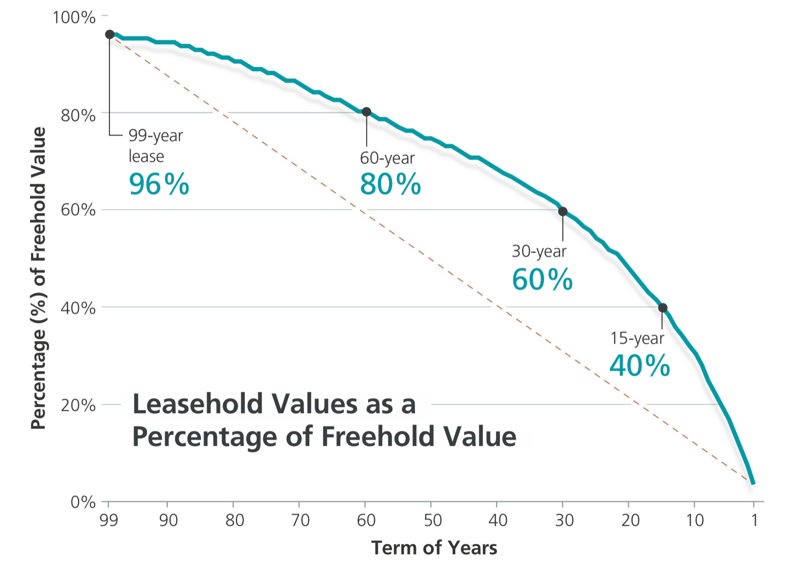

```{r setup, include=FALSE}
knitr::opts_chunk$set(echo = TRUE)
```

### __Google Data Analytics Capstone__

In this project I will be taking a look at the pernicious effects of the HDB's 99-year leasehold by quantifying the rate of intrinsic value deterioration, not accounting for inflation or market conditions. 

### Contents
1. Data Preparation 
2. Analysis  
3. Key Findings
4. Limitations 

---

### 1. Data Preperation

The data set used in this project can be found at <https://data.gov.sg/dataset/resale-flat-prices>  
This data is based on the date of registration for resale transactions between Jan 2012 and Jan 2023. 
Firstly since the data from the source splits the years up in 3 different files, we will have to append them together with power query.



The next step is to calculate the Remaining Lease of each unit at the time of transaction. Which is given by the equation: 
$$RL =  99 - (Y_{1} - Y_{0}) $$  

* Where;
  * RL = Remaining Lease
  * Y1 = Year transaction occurred
  * Y2  = Year of lease commenced\
  
  
  
This is done with the following formula in Microsoft Excel:
```
=DATE(99-(YEAR([@month])-[@[lease_commence_date]]),MONTH([@month]),DAY([@month]))
```  

Now that we have prepared our data, let's get familiar with its contents before we begin analysis. 
```{r echo=TRUE}
library(tidyverse)
dataset <- read.csv("Book1.csv")
glimpse(dataset)
unique(dataset$town)

```

The output above shows the 11 columns that we're working with and the 234,765 transactions that make up this data set. Each one of these transactions come from one of the 26 housing estates as seen above.\ 


### <br/> 2. Analysis
One might be tempted to assume a linear rate of deterioration in property value, trending toward zero. However that is not the case, the typical HDB's value follows the proverbial Bala's Curve (Fig.2). The property value is a concave downward graph that exponentially decreases it value the lower the tenure left.


To visualize this pernicious effect; Consider a 3-Room flat in Pasir Ris estate using our data let's find out the _average_ deterioration of value by creating a linear model, based on the covariance between resale price and the remaining lease. The next step is to import the "broom" package to convert our model into tidy tibbles in order to extract our estimate. 

The code below does just that and outputs a summary of the regression model, results to note are the Estimate (4449.6) and the Adjusted-R squared (0.6088).
```{r}
price_model <-dataset %>%
  filter(town == "PASIR RIS", flat_type == "3 ROOM") %>% 
  lm(resale_price ~ remaining_lease , data =.)
summary(price_model)

library(broom)
price_model %>% 
  tidy() %>% 
  filter(term == "remaining_lease") %>% 
  pull(estimate) -> slope
```
Now that we have the estimate variable (slope) we can pass this into our line plot as an annotation.

* Line by line breakdown for the code below:
  + Dataset pipe
  + Assigns axes to variables and groups prices together
  + Plots line graph and averages the aforementioned group
  + Plots regression line
  + Adds graph labels
  + Annotates depreciation rate onto graph
```{r results='hide', message=FALSE}
# Format result output as integers 
options(scipen=100)
# Visualizing the model
dataset %>% 
  ggplot(aes(x = factor(remaining_lease), y = resale_price, group = 1)) +
  geom_line(stat = 'summary', fun = 'mean') +
  geom_smooth(method = 'lm')+
  labs(title = "Relationship between resale prices and lease tenure")+
  annotate("text", x =20, y= 600000 ,label= (paste0("Depreciation ==", slope)), parse = TRUE )
```
<br/>Now we will plot this for each estate individually with the facet_wrap function. 

```{r, message=FALSE}
dataset %>% 
  filter(flat_type == '4 ROOM') %>% 
  ggplot(aes(x = factor(remaining_lease), y = resale_price, group = 1)) +
  geom_line(stat = 'summary', fun = 'mean') +
  geom_smooth(method = 'lm')+ 
  labs(title = "Tenure deterioration rate for 4-Room flats by estate")+
  facet_wrap(~town)
```


### 3. Key Findings

* Tenure deterioration varies by estate:
  + Mature estates command a higher resale price despite a higher rate of deterioration
  + Estates located further from the downtown core has a lower rate of deterioration
  + Pricier estates naturally have a higher rate of deterioration 
  
These different deterioration profile should be noted by potential homeowners and must be considered in their decision making process. Homeowners are generally aware of the estate premium they pay for a more accessible location but far too often forget about the long-term value deterioration that comes with these 'premium' estates come with.

### 4. Limitations

This is a gross oversimplification and overlooks the many complexities of real estate (i.e. Interest Rates, Inflation, Market Sentiment). The scope of data only tracks transactions between 2012 - 2023 Jan, a relatively prosperous period for the housing market, and is devoid of the many fluctuations in the preceding decades (e.g. 2008 Recession, Asian Finical Crisis). This case study extrapolates a linear model from a  typically non-linear projection,  
